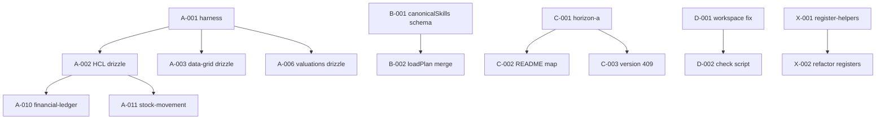

# Improvement backlog — master list

**Format:** `ID` · theme · effort · layer · status · acceptance criteria  
**Effort:** S (<4h) · M (1–3d) · L (3–10d) · XL (>10d)  
**Status:** `open` unless noted

Prioritized clusters match [executive-summary.md](./executive-summary.md) Sprints A–D.

---

## Sprint A — Prove Drizzle (reliability)

| ID | Title | Effort | Layer | Acceptance criteria |
| --- | --- | --- | --- | --- |
| **A-001** | Shared drizzle-sqlite test harness | M | infra | `internal/test-harness` with migrate helper; documented in dev-conventions; consumed by ≥1 package test |
| **A-002** | HCL `createDrizzleLedgerStore` integration test | M | hash-chained-ledger | append ×3, snapshot, verify pass; tamper hash → verify fails |
| **A-003** | data-grid `executeDrizzleList` integration test | M | data-grid | sqlite orders fixture; eq, between wall, decimal gte, sort, cursor, count |
| **A-004** | data-grid `buildDrizzleQuery` unit+SQL snapshot | S | data-grid | Generated SQL matches fixture for 3 filter combos |
| **A-005** | valuations all 9 methods parametric tests | L | valuations | fifo,lifo,fefo,hifo,lofo,movingAverage,weightedAverage,standardCost,specificIdentification each have ≥1 consume case |
| **A-006** | valuations drizzle layer store test | M | valuations | createDrizzleLayerStore append + FIFO consume against sqlite |
| **A-007** | doc-number scoped sequence concurrency test | M | doc-number | two parallel `next()` same scope → unique SEQ; timezone boundary if scope uses {YYYY} |
| **A-008** | rbac drizzle store assignRole + can() | S | rbac | integration test green |
| **A-009** | epoch drizzle bump + bumpMany | S | epoch | sqlite store; bumpMany updates all listed scopes |
| **A-010** | financial-ledger multi-currency post + verify | M | financial-ledger | two currencies same accountId; drizzle path |
| **A-011** | stock-movement multi-lot append + verify | M | stock-movement | uses A-002 harness; locationIdFromParts + lotId |
| **A-012** | qups drizzle profile store round-trip | S | qups | save profile, load, calculateLine uses stored modifiers |
| **A-013** | `pnpm test:integration` root script | S | root | **done** — runs `**/drizzle.integration.test.ts`; wired in `pr` profile + PR `eristack ci` drift |
| **A-014** | ai-dev `--profile integration` | S | ai-dev | **done** — `pnpm eristack check --profile integration`; documented in ai-dev docs + dev-conventions |

---

## Sprint B — Agent routing truth (cheap tokens)

| ID | Title | Effort | Layer | Acceptance criteria |
| --- | --- | --- | --- | --- |
| **B-001** | Recipe schema `canonicalSkills: string[]` | M | ai-knowledge | recipes.yaml validated; ≥3 ERP recipes use field |
| **B-002** | `loadPlan()` merges canonicalSkills | M | ai-knowledge | document-lines-erp plan includes ai-knowledge skill id; test added |
| **B-003** | Trim recommend-eristack catalog embed | S | ai-knowledge | SKILL.md ≤100 lines; points to generated catalog / sync |
| **B-004** | jwt-auth-adapters → 1 source | M | jwt-auth | **done** — wiring-production.md |
| **B-005** | doc-number-adapters → 1 source | M | doc-number | **done** — wiring-production.md |
| **B-006** | money-adapters → 1–2 sources | M | money | **done** — wiring-production.md; core skills trimmed to getting-started |
| **B-007** | data-grid-adapters → ≤3 sources | S | data-grid | **done** — wiring-production.md; core skill trimmed |
| **B-008** | Recipe triggers: applyCellPatch, atomic, wall | S | ai-knowledge | **done** — recipes + recommend.test |
| **B-009** | Recipe triggers: compareDecimalStrings, bumpMany | S | ai-knowledge | **done** — recipes + recommend.test |
| **B-010** | Recipe triggers: documents.transitions, assignmentPairMatch | S | ai-knowledge | **done** — recipes + recommend.test |
| **B-011** | AGENTS.md intent block sync (6 skills) | S | root | **done** — ERP guides, backseat, multitab, logger, rest |
| **B-012** | skills:validate max sources rule | S | root | **done** — fails CI when >3 sources without ticket.yaml override |
| **B-013** | Fill stub adapter skills (rbac,pbac,stock,epoch,fin,val) | M | service/capability | **done** — express/nest snippets in adapter skills |
| **B-014** | hash-chained-ledger-core skill sources block | S | hash-chained-ledger | **done** — sources → getting-started.md |
| **B-015** | Fix recommend.test expected catalog (ai-dev) | S | ai-knowledge | test green after ai-dev in catalog |
| **B-016** | CI mirror hash knowledge ↔ docs | M | ai-knowledge | **done** — check-knowledge-docs-mirror.mjs in sync:check |
| **B-017** | qups-line skill embed applyCellPatch | S | qups | **done** — body documents API without opening docs |
| **B-018** | timestamp-core skill decision tree | S | timestamp | **done** — wall vs instant in skill body |

---

## Sprint C — Show don't tell (predictable)

| ID | Title | Effort | Layer | Acceptance criteria |
| --- | --- | --- | --- | --- |
| **C-001** | `examples/horizon-a` composite app | L | examples | **done** — qups + grid wall + epoch + pbac + jwt + tests |
| **C-002** | README maps to document-lines-erp sections | S | examples | **done** — numbered section parity in README |
| **C-003** | Optimistic version 409 demo in horizon-a | M | examples | **done** — PATCH stale version → 409 in main.ts demo |
| **C-004** | Nest data-grid drizzle list sample | M | examples/nestjs | **done** — `GET /orders` + executeDrizzleList |
| **C-005** | Examples build in CI | S | root | **done** — examples `build` script + `pr` profile runs build |
| **C-006** | eristack check `--profile examples` | S | ai-dev | **done** — `pnpm eristack check --profile examples` |
| **C-007** | backseat seed pack v1 JSON | M | backseat | **done** — `horizon-a-v1.json` + `loadHorizonASeedV1()` |
| **C-008** | jwt-auth express supertest E2E | M | jwt-auth | **done** — express.e2e.test.ts login/refresh/revoke |
| **C-009** | multitab React provider smoke test | S | multitab | **done** — SSR render + missing-provider guard |
| **C-010** | epoch + TanStack Query demo in horizon-a | M | examples | **done** — epoch-cache + epoch-query tests + main demo |

---

## Sprint D — Publish hygiene (clear boundaries)

| ID | Title | Effort | Layer | Acceptance criteria |
| --- | --- | --- | --- | --- |
| **D-001** | Audit workspace:* in dependencies | M | 7 packages | all moved to peer/dev |
| **D-002** | `check-publish-deps.mjs` | S | root | **done** — `pnpm publish:check` in `pr` profile |
| **D-003** | Peer map jwt-auth → data-grid | S | jwt-auth | peerDependencies + docs |
| **D-004** | Peer map data-grid → timestamp | S | data-grid | optional peer for wall |
| **D-005** | Peer map doc-number → data-grid, timestamp | S | doc-number | |
| **D-006** | `@eristack/*/testing` subpath pattern | L | multi | memory stores moved; main export clean; migration note in upgrading.md |
| **D-007** | eristack check `--profile publish` | S | ai-dev | runs D-002 |
| **D-008** | ai-dev publish 0.1.0 | S | ai-dev | changeset; CHANGELOG |
| **D-009** | ai-ticket-generator getting-started.md | S | ai-ticket-generator | docs + _meta.json sync |
| **D-010** | changesets max body lines (optional) | S | root | warn at 80 lines |

---

## Cross-cutting — Backseat spine

| ID | Title | Effort | Layer | Acceptance criteria |
| --- | --- | --- | --- | --- |
| **X-001** | `@eristack/backseat` register-helpers | M | backseat | **done** — normalizeBasePath, versionConflict exported from adapters |
| **X-002** | Refactor 9 package register.ts | M | multi | each ≤40 lines; uses helpers |
| **X-003** | Unified 409 JSON canon doc | M | ai-knowledge | **done** — http-errors.md + docs mirror + skill |
| **X-004** | pbac backseat errors use jsonError | S | pbac | matches backseat envelope |
| **X-005** | IndexedDB store smoke test | M | backseat | fake-indexeddb or playwright |
| **X-006** | listRoutes() coverage test | S | backseat | **done** — horizon-a spine.test.ts ≥12 routes |

---

## Docs-only (no code)

| ID | Title | Effort | Acceptance criteria |
| --- | --- | --- | --- |
| **DOC-001** | valuations method picker table | S | getting-started.md compares FIFO/LIFO/FEFO/… |
| **DOC-002** | abac attrs vs money warning | S | abac-core skill + docs |
| **DOC-003** | AGENTS.md no-git wording fix | S | human commits _meta.json |
| **DOC-004** | web doc-agent-skills ERP CTAs | M | qups/backseat/pbac pages |
| **DOC-005** | financial-ledger Moneyish boundaries | S | skill + getting-started |
| **DOC-006** | ai-workflow vs ai-dev vs ai-knowledge tree | S | ai-knowledge canonical md |

---

## ai-dev / tooling

| ID | Title | Effort | Acceptance criteria |
| --- | --- | --- | --- |
| **T-001** | runChecks unit tests | M | mock subprocess; registry order |
| **T-002** | MCP dev_plan snapshot test | S | |
| **T-003** | sync command integration test | S | dry-run docs:sync |
| **T-004** | money express/nest smoke tests | S | one route each |
| **T-005** | pbac express 409 test | S | supertest |

---

## Horizon / future (do not implement until promoted)

| ID | Title | Notes |
| --- | --- | --- |
| **H-001** | `@eristack/doc-transitions` presets | See roadmap/horizon.md |
| **H-002** | `@eristack/opinion` REST canon package | horizon |
| **H-003** | `@eristack/test-stores` unified memory | alternative to D-006 per-package testing |
| **H-004** | tRPC adapter layer | horizon note only |

---

## Dependency graph (backlog)

---

## Suggested execution order (first 20 ids)

1. A-001 → A-002 → A-003 (unblocks credibility)
2. B-001 → B-002 → B-015 (agent routing)
3. D-001 → D-002 (publish safety)
4. A-005 → A-006 (valuations)
5. B-003 → B-004 → B-005 (token budget)
6. C-001 → C-005 (example + CI)
7. X-001 → X-002 (maintainer ergonomics)
8. B-011 → B-012 (AGENTS + lint)
9. Remaining A-* by package priority
10. D-006 (memory testing subpath — large, schedule last in D)

---

## Status tracking

| Sprint | Open | Done |
| --- | ---: | ---: |
| A | 14 | 0 |
| B | 18 | 0 |
| C | 10 | 0 |
| D | 10 | 0 |
| X | 6 | 0 |
| DOC | 6 | 0 |
| T | 5 | 0 |

**Total open items:** 69 (excluding horizon H-*)

When an item ships, mark `done` here with date — optional one-line in package CHANGELOG.

---

## Risk register

| Risk | Mitigation |
| --- | --- |
| D-006 breaks consumer imports | Deprecation re-export from main for one minor 0.x |
| Integration tests flaky on CI | sqlite file temp per test; no shared state |
| Fat skill collapse loses detail | wiring-production.md must be ≥100 lines substantive |
| horizon-a scope creep | Fixed entity set: orders + lines only |
| workspace fix breaks local examples | peerDependenciesMeta optional where needed |
