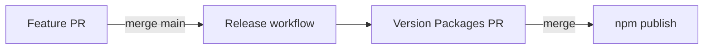

# Money adapters release plan

Conventional Changesets train for the money / qups / ledger / valuations / ai-knowledge batch. **No local `changeset version`.**

## What ships together (feature PR — you commit once)

### Code + tests

- `@eristack/money` — `src/core/`, adapter subpaths, Zod 4 peer
- `@eristack/qups` — shared `currency` + `*Amount` columns (breaking)
- `@eristack/financial-ledger` — hydrate helpers
- `@eristack/valuations` — `unitCostAmount` (breaking)

### Docs (package source of truth)

- Money: `adapters.md` hub + per-subpath pages (`drizzle.md`, `rest.md`, `zod.md`, …)
- QUPS / financial-ledger / valuations: dependent deltas only

### ai-knowledge (do **not** revert when fixing version mistakes)

| Artifact | Status |
| --- | --- |
| `money-adapters`, `money-ledger` skills | Content ships; `library_version` in YAML is optional — catalog reads `package.json` |
| `qups-adapters`, `financial-ledger-core`, `valuations-adapters` skills | Updated |
| `stack-defaults.md` + skill | Zod 4 only |
| `recipes.yaml` | `money-persist`, `line-pricing-qups` |
| `src/generated/catalog.ts`, `recipes.ts` | Synced at **current** versions (0.2.1 / 0.1.x) — correct until Version PR |
| `recommend-eristack/SKILL.md` catalog block | From sync |

### Pending changesets (leave in repo)

| File | Package | Bump |
| --- | --- | --- |
| `.changeset/money-adapters.md` | `@eristack/money` | minor → **0.3.0** |
| `.changeset/qups-money-columns.md` | `@eristack/qups` | minor → **0.3.0** |
| `.changeset/financial-ledger-hydrate.md` | `@eristack/financial-ledger` | minor → **0.2.0** |
| `.changeset/valuations-unit-cost-amount.md` | `@eristack/valuations` | minor → **0.2.0** |
| `.changeset/ai-knowledge-money-adapters.md` | `@eristack/ai-knowledge` | patch → **0.1.7** |

## What stays out of the feature PR

- Bumped `version` in any `package.json`
- New `CHANGELOG.md` sections
- Local `pnpm changeset version` or `pnpm release`

## Flow (two PRs)

1. **Feature PR** — all rows above + `pnpm ci` green.
2. **Merge to `main`** — Release action opens **chore: version packages**.
3. **Version Packages PR** — bot runs `pnpm version-packages` (`changeset version` + `pnpm knowledge:sync` + lockfile). Catalog versions jump to 0.3.0 / 0.2.0 / 0.1.7 automatically.
4. **Merge Version PR** — `pnpm release` publishes to npm.

## Consumer migration (for changelogs / support)

- **Money:** import adapters from `@eristack/money/drizzle`, `/rest`, `/zod`, …; core `@eristack/money` unchanged.
- **QUPS:** one `currency` column; amounts are `unitPriceAmount`, etc.; run Drizzle migration for renamed columns.
- **Valuations:** layer column `unitCostAmount` (numeric), not `unitCost` text.
- **Zod:** peer `zod ^4.0.0` only on `@eristack/money/zod`.

## Pre-merge checklist

- [ ] `pnpm ci`
- [ ] Five `.changeset/*.md` files present; no version bumps in package.json
- [ ] Skills/recipes/catalog **not** reverted
- [ ] No hand-edited CHANGELOGs
