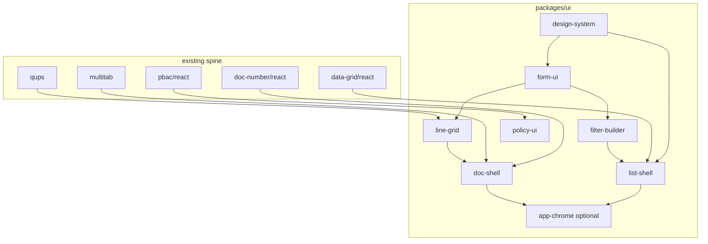

# Eristack UI package stack (plan)

**Goal:** Name the **UI packages we should actually ship** so ERP apps stop rebuilding the same TanStack Router + Query + Form + shadcn screens. Be opinionated: if `@eristack/data-grid`, `@eristack/qups`, `@eristack/multitab`, and `@eristack/pbac` already exist, the **list page** and **document page** shells are not “app polish” — they are **library work**.

**Relationship:** Headless domain values stay in primitives (`money/react/fields`, etc.) — see [`../react-domain-fields/overview.md`](../react-domain-fields/overview.md). This plan is **styled, composable React** in `packages/ui/`.

**Rule:** One package per iteration, full ship checklist. **`design-system` before `form-ui` before `line-grid`** — tokens and inputs are prerequisites for dense ERP UI.

---

## What we already have (do not duplicate)

| Package | Role | UI gap |
| --- | --- | --- |
| `@eristack/multitab` | Headless dirty tabs + router sync | No tab chrome, no “document tabs” preset |
| `@eristack/data-grid` | Query parse + list HTTP + hooks | No table UI, no filter builder, no column manager |
| `@eristack/qups` | Line math | No spreadsheet line editor |
| `@eristack/doc-number/react` | Format hooks | No preview chip in header |
| `@eristack/rbac/react`, `pbac/react` | `useCan`, `useBusinessPolicy` | No declarative `<PolicyGate>` / disabled tooltips |
| `@eristack/epoch/react` | Cache policy hook | No “data stale” banner |
| `@eristack/jwt-auth/react` | Auth context | No login shell (app OK to own) |

---

## Tier 0 — Foundation (ship first)

### U02 `@eristack/design-system` (**bold: ship now**)

**Why now:** Every other UI package will copy-paste shadcn if we wait. One **Erista token preset** (radius, density, semantic colors for status/doc states) + documented **shadcn `components.json` alias map** (`@eristack/design-system` re-exports or documents pinned shadcn primitives).

| In scope | Out of scope |
| --- | --- |
| CSS variables / Tailwind preset export | Full component library fork of shadcn |
| Status colors aligned with doc-transitions / pbac language | Marketing site theming (apps/web stays separate) |
| `DensityProvider` (compact / comfortable) | Dark mode perfectionism in v0 |

**Peers:** `tailwindcss`, `react`. Apps still run `shadcn add` — we ship **tokens + patterns**, not 40 components.

### U04 `@eristack/form-ui` (**bold: ship with money + timestamp fields**)

Consolidates catalog U04b, U23, U25, U24 into **one** package:

- `MoneyInput`, `TimestampInstantInput`, `TimestampWallInput`, `PercentInput`, `UomQuantityInput` (as peers ship)
- Wires `@eristack/*/react/fields` headless hooks to shadcn `Input`, `Popover`, `Calendar`
- `FormField` wrapper: label, description, `aria-invalid`, error from TanStack Form meta

**Not** `@eristack/form-kit` (that stays TanStack Form recipes + `/options` loaders — headless).

---

## Tier 1 — ERP screen spine (**bold: these are the product**)

### U05 `@eristack/list-shell` (rename intent from “data-dense-table”)

**The default list page** for Backseat → Express graduation:

- `ListPageLayout` — title, primary action, breadcrumb slot
- `DataGridTable` — TanStack Table + `@eristack/data-grid` query sync (sort, page, filters in URL)
- Toolbar: search mode toggle, refresh, export hook point (pairs Wave 13 `spreadsheet-render` at app boundary)
- Row actions slot, bulk select optional v1
- Loading / empty / error states tied to Query status

**Peers:** `@eristack/data-grid/react`, `@eristack/design-system`, TanStack Table, TanStack Router.

**Recipe:** `erp-list-and-doc-screens` loads this + data-grid skill.

### U26 `@eristack/filter-builder` (can merge into list-shell v2 — **ship as subpath first**)

Visual editor for `data-grid` filter JSON — field picker from column defs, op select (`eq`, `contains`, `between`, …), value widgets from **form-ui** (money, wall date range).

Export: `FilterChipBar` + “Advanced filters” sheet.

**Bold claim:** Without this, every app reimplements half of Salesforce list filters badly.

### U08 `@eristack/line-grid` (**bold: P0 for document-with-lines ERP**)

Spreadsheet UX for QUPS lines:

- Keyboard nav (Tab, Enter, arrow), paste TSV, add/remove row
- Column defs from `withQupsColumns` / app extensions
- Calls `calculateLine` / `patchLine` on edit — **same strings as API**
- Optional footer totals row (Money display only)

**Peers:** `@eristack/qups`, `@eristack/form-ui`, `@eristack/money`.

**Not in v0:** Pinned columns, Excel formula bar, cross-sheet refs.

### U03 `@eristack/doc-shell`

Document **chrome** (not business layout grid):

- Header: doc number (`useDocNumberFormats`), status badge (doc-transitions colors from design-system), version/etag slot
- Action bar: Save, Post, Cancel — slots for pbac-gated buttons via `@eristack/policy-ui` (below)
- `DocShell` + `DocBody` + sticky footer for totals
- Integrates `@eristack/multitab` “open in tab” props optional

Pairs with **line-grid** for invoice/PO screens.

### U14 `@eristack/master-detail`

Split view: list selection drives detail route or embedded form — TanStack Router search param pattern **encoded once**.

Smaller than list-shell; composes with list-shell for “pick partner → edit” flows.

---

## Tier 2 — Operator UX (ship after Tier 1 proves in examples/react)

### U06 `@eristack/command-palette`

Cmd+K: jump to routes, recent docs, actions (post invoice if pbac allows). Uses `@eristack/rbac/react` for action visibility.

### `@eristack/policy-ui` (**new catalog row — bold**)

Thin wrappers:

- `<Can permission="…">`, `<BusinessPolicy check="…">`, `usePolicyDisabledReason`
- Disabled button + tooltip when pbac denies (maps `BUSINESS_POLICY_DENIED` copy)

Keeps **policy logic in pbac** — UI only reflects it.

### U16 `@eristack/audit-timeline`

Renders append-only audit events (who/when/field deltas) — **presentation only**; app supplies rows from audit-event service when it exists.

### U17 `@eristack/approval-inbox`

List + detail for pending approvals — composes list-shell + doc-shell; state machine from app.

### U28 `@eristack/column-manager` + U27 `@eristack/saved-view`

Often ship **with** list-shell as `./list-shell/views` subpaths:

- Persist column order/visibility (localStorage v0, API v1)
- Saved filter + sort presets per user

---

## Tier 3 — Specialized (horizon, not blocking ERP MVP)

| Package | Notes |
| --- | --- |
| U07 `print-view` | Print CSS + `@media print` for doc-shell |
| U11 `calendar-view` | Resource calendar — wall timestamp |
| U15 `attachment-panel` | file-manager client shell |
| U19 `chart-kit` | Reporting dashboards |
| U20 `map-pin` | geo + maps peer |
| U21–U22 scanner/signature | Warehouse/mobile |

**Deprecate as standalone UI rows:** U23–U25 (`money-input`, `qty-input`, `wall-date-picker`) — folded into **form-ui**.

---

## Tier 4 — App chrome (**bold optional package**)

### `@eristack/app-chrome` (new — **controversial but useful**)

Single layout for operational apps:

- Sidebar nav from route tree config
- `@eristack/multitab` strip
- Global command palette slot
- `@eristack/epoch/react` stale banner
- `@eristack/http-errors` toast mapper (see below)

**Boundary:** App owns nav items and branding; library owns **spacing, responsive collapse, tab + content regions**.

If this feels too opinionated, document the same composition in **`examples/react`** only and skip the package until a second consumer asks.

### `@eristack/query-states` (micro — or part of list-shell)

`QueryBoundary` — skeleton, empty illustration, retry, `STALE_EPOCH` refresh CTA.

### `@eristack/http-errors-ui` (micro)

Map unified JSON error envelope to toast / inline alert (`CONFLICT_VERSION` → “Refresh and retry”).

---

## Recommended ship order (12 iterations)

| # | Package | Depends on | Proves |
| --- | --- | --- | --- |
| 1 | `design-system` | — | tokens in examples/react |
| 2 | money headless fields | money core | react-domain-fields Phase 1 |
| 3 | `form-ui` (Money + Percent) | design-system, headless | one invoice line form |
| 4 | timestamp headless + form-ui dates | timestamp | due date on doc |
| 5 | `list-shell` v0 | data-grid, design-system | partner list demo |
| 6 | `filter-builder` | list-shell, form-ui | filtered list URL |
| 7 | `line-grid` v0 | qups, form-ui | 3-line QUPS doc |
| 8 | `doc-shell` | doc-number, multitab optional | header + actions |
| 9 | `policy-ui` | rbac, pbac | gated Post button |
| 10 | `master-detail` | list-shell | partner pickers |
| 11 | `command-palette` | router | ops navigation |
| 12 | `app-chrome` or examples-only doc | multitab, above | full ERP shell |

**Parallel track:** Wave 13 platform packages do not block UI Tier 0–1 except **spreadsheet-render** hook on list export.

---

## Architecture diagram

---

## Non-goals

- Replacing shadcn — we **embrace** it
- Full CRM/kanban/gantt suites in v0
- Feature packages (`@eristack/feature-*`)
- Bundling map/chart vendors in core UI packages

---

## Promotion

When Tier 0 + Tier 1 (items 1–8) ship: promote **`knowledge/ui-package-stack.md`**, recipes **`erp-ui-shell-tanstack`** and **`erp-list-and-doc-screens`**, update catalog statuses, delete this WIP folder.
