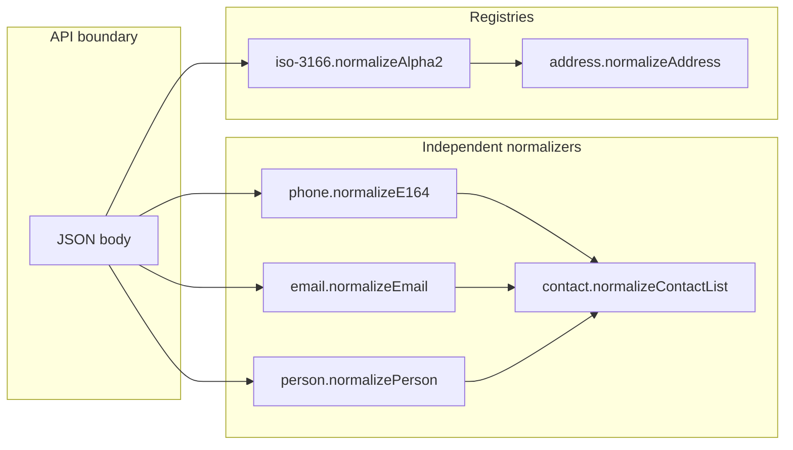

# Wave 13 — collaboration without hard subscription

**Preference:** Packages **collaborate through shared contracts and compose-at-the-boundary**, not by wiring every sibling as a **required** `dependencies` entry. Optional **peers** only when a package truly cannot function without the other (e.g. `weight` → `uom`). No “god” meta-package that subscribes to all thirteen.

Canonical promotion target: one `@eristack/ai-knowledge` guide `knowledge/party-and-platform-compose.md` (+ recipe) — agents load **one file** for multi-package pipelines.

---

## Rules (design targets)

| Rule | Meaning |
| --- | --- |
| **Core stays framework-free** | No Express/React/Drizzle in primitive cores |
| **No sibling hard deps in primitives** | `person` does not import `phone`; `contact` does not require `person` at publish time |
| **Same strings in → same strings out** | Normalized phone is E.164 string; normalized email is `local@domain`; contact stores those shapes |
| **Compose in app or one helper module** | App API handler calls normalize chain; optional **`/compose` subpath** only where it saves real duplication (see below) |
| **One ERP recipe per pipeline** | `party-contact-normalize`, `platform-api-guard`, `outbound-email-pdf` list packages + load order |
| **Optional peers for adapters only** | Drizzle stores, libphonenumber, Redis rate limit — not for cross-primitive normalize |

---

## Interop contracts (types align without importing)

These are **documented contracts** — each package validates its slice; composed JSON is stable in Drizzle.

```ts
// Party slice (app-owned partyId on parent row)
type PartyContactPayload = {
  person?: import("@eristack/person").Person; // or personId FK only
  channels: import("@eristack/contact").ContactChannel[];
};

// Channel fields after boundary normalize:
// phone?: E164Phone   — from @eristack/phone normalizeE164
// email?: string      — from @eristack/email-address normalizeEmail
// personId?: string   — FK to app persons table (person row normalized with @eristack/person)
```

**Address / geo (logistics):** orthogonal — same partner row may have:

- `PostalAddress` (`@eristack/address`) + strict country (`@eristack/iso-3166`)
- `GeoPoint` (`@eristack/geo`) for map/distance — **not** a substitute for postal
- `Dimension` (`@eristack/dimension`) for carton size; mass/volume via `@eristack/uom` unless typed weight/volume packages ship later

---

## Party pipeline (collaborate, do not subscribe)



**Handler pattern (copy-paste in getting-started — not hidden inside one package):**

```ts
import { normalizePerson } from "@eristack/person";
import { normalizeE164 } from "@eristack/phone";
import { normalizeEmail } from "@eristack/email-address";
import { normalizeContactList } from "@eristack/contact";

export function normalizePartyInput(body: PartyInput) {
  const person = body.person ? normalizePerson(body.person) : undefined;
  const channels = normalizeContactList({
    channels: body.channels.map((ch) => ({
      ...ch,
      phone: ch.phone ? normalizeE164(ch.phone) : undefined,
      email: ch.email ? normalizeEmail(ch.email) : undefined,
    })),
  });
  return { person, channels };
}
```

**When to add `@eristack/contact/compose` (optional, Wave A3):**

- Subpath **`@eristack/contact/compose`** may re-export the above **only if** it uses **`peerDependencies`** on `person`, `phone`, `email-address` (all optional meta optional: false as a group — consumers who want one import add all peers).
- Default path remains **separate imports** — no subscription for minimal apps.

---

## Measures pipeline (dimension + uom + geo)

| Step | Package | Role |
| --- | --- | --- |
| 1 | `dimension` | Normalize L×W×H; `unit` is opaque string or validated via uom at app |
| 2 | `uom` | Convert mass/volume qty if line items need kg/L |
| 3 | `geo` | Distance warehouse ↔ delivery geocode (optional) |

**Collaboration:** `dimension.unit` should use **same unit codes** as `@eristack/uom` catalog (`mm`, `m`, `cm`) — document in both packages; **no import** unless optional peer validates unit in `normalizeDimension`.

---

## Platform pipeline (API edge — collaborate by order)

Middleware / handler **order** (document in `platform-api-guard` recipe):

```text
1. rate-limit.check(clientIp | apiKeyPrefix)  → 429 + Retry-After
2. api-key.verify(Authorization)               → 401
3. idempotency.run(Idempotency-Key, handler) → replay / 409 in-flight
4. business handler (payment-manager, comms, …)
```

| Package | Collaborates with | Subscription |
| --- | --- | --- |
| `rate-limit` | Express/Nest app middleware | None |
| `api-key` | App user/partner table | None in core |
| `idempotency` | `@eristack/payment-manager`, `@eristack/comms` POST | None — app passes same key header |

**Shared header names** (export constants from each package, same string values):

- `Idempotency-Key` — idempotency
- `Authorization: Bearer …` — api-key verify helper
- `Retry-After` — rate-limit result

No package imports another; **recipe + one compose doc** shows wiring.

---

## Outbound content (email + PDF + spreadsheet)

| Flow | Packages |
| --- | --- |
| Transactional email | `person.formatPersonDisplay` → template vars → `email-template.render` → `comms` send |
| Invoice PDF | `address.formatAddressLines` → HTML template → `email-template.render` → `pdf-render` driver |
| List export (xlsx/csv) | `data-grid` list in app → map rows to strings → `spreadsheet-render` workbook → HTTP download or `file-manager` upload |
| Master import (inverse) | **`@eristack/import-job`** (horizon) — not spreadsheet-render; share **column key** naming with export DTOs only |

**Collaboration:** template variables are **`Record<string, string>`** — formatters from person/address/money JSON run **before** render; no circular deps.

```ts
import { formatPersonDisplay, normalizePerson } from "@eristack/person";
import { formatAddressLines, normalizeAddress } from "@eristack/address";
import { renderEmailTemplate } from "@eristack/email-template";

const vars = {
  contactName: formatPersonDisplay(normalizePerson(input.person)),
  shipTo: formatAddressLines(normalizeAddress(input.shipTo)).join("\n"),
};
const html = renderEmailTemplate(templateBody, vars);
// comms.send({ html, … }) or pdfRenderer.render({ html })
```

**Spreadsheet export (no subscription to data-grid):**

```ts
import { workbookFromRows, createSpreadsheetRenderer } from "@eristack/spreadsheet-render";
import { createExcelJsDriver } from "@eristack/spreadsheet-render/exceljs"; // optional adapter when shipped

const columns = [
  { key: "sku", header: "SKU" },
  { key: "qty", header: "Qty" },
  { key: "amount", header: "Amount" },
];
// App maps list items — Money already formatted as decimal strings
const workbook = workbookFromRows(columns, listItems.map((row) => ({
  sku: row.sku,
  qty: row.qty,
  amount: row.lineTotalFormatted,
})));
const bytes = await createSpreadsheetRenderer(createExcelJsDriver()).render(workbook, "xlsx");
```

---

## Recipes (discovery — substitute for “subscription”)

Add **three composite recipes** when packages ship (not thirteen isolated entries only):

| Recipe id | Primary | Supporting (load, not hard dep) |
| --- | --- | --- |
| `party-contact-normalize` | contact | person, phone, email-address, address, iso-3166 |
| `platform-api-guard` | idempotency | rate-limit, api-key |
| `outbound-message-render` | email-template | person, address, comms, pdf-render |
| `spreadsheet-export-download` | spreadsheet-render | data-grid (app list), money (format cells in app), file-manager (optional attach) |

Each recipe **`rationale`** must name **one** canonical markdown section (after promotion: `knowledge/party-and-platform-compose.md`).

---

## Testing collaboration (CI)

- **No monolithic integration package test** in v0.
- Each package: unit tests on its normalizer.
- **One repo example** (optional `examples/party-normalize` or extend `examples/express`): single route that runs full party pipeline — proves collaboration without coupling packages.

---

## Anti-patterns

| Avoid | Do instead |
| --- | --- |
| `contact` imports `phone` in core | Document compose snippet; optional `/compose` subpath |
| Single `@eristack/party` mega-package | Recipe + compose guide |
| `weight`/`volume` duplicate uom | Use uom; shared recipe |
| pdf-render imports email-template | App passes rendered HTML string |
| spreadsheet-render imports data-grid | App passes `SpreadsheetWorkbook` built from list results |
| Required peer web between all Wave 13 packages | Optional peers only where listed |

---

## Ship checklist addition (every Wave 13 package)

- [ ] **Collaboration section** in `docs/getting-started.md`: “Works with” table + 5-line compose snippet
- [ ] Exported types usable as **nested JSON** in parent objects
- [ ] Recipe updated (single or composite) with **supporting** packages, not merged codebases
- [ ] `package-relationships.md` row lists **compose with**, not **depends on**
